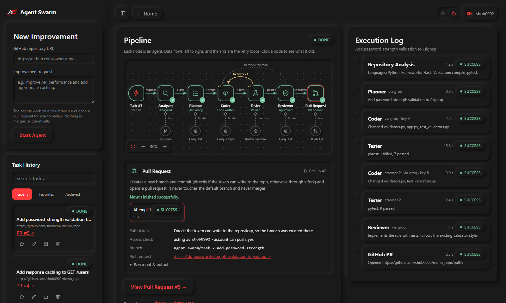
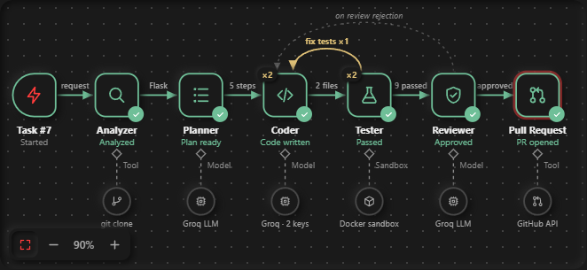
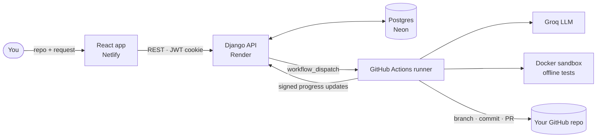

<div align="center">


# Agent Swarm

### Point it at a GitHub repo, describe an improvement, get a reviewed pull request.

A pipeline of AI agents that **plans, codes, tests, reviews and opens a PR**,
and retries on its own when tests fail or the reviewer pushes back.

<br />

[](https://agswarm.netlify.app)
[](docs/GUIDE.md)


</div>

<br />

<p align="center">
  
</p>

---

## ✦ The idea

Most "AI coding" demos stop at a code snippet. Agent Swarm takes it all the way to a **real pull request**: written, tested in a sandbox, reviewed, and opened on GitHub for a human to merge.

```text
  you:   https://github.com/you/your-app   +   "Reject weak passwords on /signup and add tests"
  swarm: analyze → plan → code → test → (fix) → review → branch + commit + PR
  you:   ✓ PR #5 opened · tests 9 passed · reviewer approved   →   you merge it (or don't)
```

It **never touches your default branch and never merges anything.** A human always has the last word.

---

## ✦ How it works

<p align="center">
  
</p>

| | Agent | What it does | Powered by |
|:-:|---|---|---|
| 🔍 | **Analyzer** | Clones the repo and detects the stack and how it builds and tests. Python, Node.js and TypeScript are supported. | git, no AI |
| 🧭 | **Planner** | Turns your request into concrete, ordered steps, plus the PR title and summary. | Groq LLM |
| ⌨️ | **Coder** | Writes the change. On a retry, it gets the test failures or review issues as instructions. | Groq LLM (two keys, rotated) |
| 🧪 | **Tester** | Installs dependencies, then runs the repo's own build, tests and linter in an **offline Docker sandbox**. | Docker, no AI |
| 🛡️ | **Reviewer** | Checks that the request was actually implemented, conventions are followed, and there are no regressions or security problems. Safety checks can veto it. | Groq LLM + rules |
| 🔀 | **GitHub agent** | Opens the PR, directly if it has write access or **via a fork** if not. | GitHub API |

**Self-correcting, but bounded.** A failing test sends the work back to the Coder, and so does a rejected review. Both loops have hard limits, so the pipeline can't run forever.

**Resumable.** Every stage saves a checkpoint. If a run fails at the PR step, **Retry** reopens only that step, with no re-planning, re-coding or re-testing.

---

## ✦ Highlights

<table>
<tr>
<td width="50%" valign="top">

**🎛️ n8n-style live canvas**<br />
Watch each agent light up as it works. Click any node to see its real inputs and outputs: the plan, the files written, the test results table, the reviewer's verdict.

</td>
<td width="50%" valign="top">

**🔒 Sandboxed by design**<br />
Untrusted repo code runs in Docker with **no network and no secrets**. Only the dependency-install step can reach the internet.

</td>
</tr>
<tr>
<td valign="top">

**🧾 Pull requests worth reviewing**<br />
Each PR explains the objective, the reasoning, the plan, the files changed, the test results, the review decision and the full agent trace.

</td>
<td valign="top">

**💸 $0 to run**<br />
GitHub Actions does the heavy lifting; Render, Netlify, Neon and Groq free tiers do the rest. No Celery, no Redis, no paid servers.

</td>
</tr>
<tr>
<td valign="top">

**🧯 Guard-rails, not vibes**<br />
Secret scanning and protected paths, signed runner callbacks, strict repo URL validation. It never writes to `main` and never auto-merges.

</td>
<td valign="top">

**🔑 Sign in your way**<br />
Email, Google or GitHub, with CSRF-safe OAuth, verified-email account linking and HttpOnly JWT cookies.

</td>
</tr>
</table>

---

## ✦ Architecture



The web server never runs agents. It records the task and hands it to a GitHub Actions run, and the run reports back over an HMAC-signed API without ever touching the database.

---

## ✦ Tech stack

| Layer | Choice | Why |
|---|---|---|
| API | **Django + DRF** | Mature, batteries-included auth, admin and ORM |
| Auth | **allauth + dj-rest-auth + SimpleJWT** | Email, Google and GitHub sign-in with HttpOnly cookies |
| Agents | **Groq · `openai/gpt-oss-120b`** | Fast, free-tier friendly, with independent per-key limits |
| Execution | **GitHub Actions** | Free compute with Docker built in; replaced Celery and Redis |
| Sandbox | **Docker** | Isolates untrusted code: no network, no secrets, capped resources |
| GitHub | **REST Git Data API** | Branch, commit and PR without ever putting the token in a git remote |
| Frontend | **React + Vite** | Fast builds; a custom SVG canvas with no UI library |
| Data | **PostgreSQL (Neon)**, SQLite for local development | Persistent on free hosting, zero setup locally |

---

## ✦ Quick start (local)

> Needs Python 3.11+, Node 18+, Docker Desktop, and free API keys from [Groq](https://console.groq.com/keys).

```bash
# 1. Sandbox image
cd backend
docker build -t agent-swarm-sandbox:latest -f docker/sandbox.Dockerfile .

# 2. Backend
python -m venv venv && venv\Scripts\activate      # source venv/bin/activate on macOS/Linux
pip install -r requirements.txt
cp .env.example .env                               # add your Groq keys (+ a GitHub token for PRs)
python manage.py migrate
python manage.py runserver

# 3. Frontend (new terminal)
cd frontend
npm install
npm run dev                                        # http://localhost:5173
```

Locally the pipeline runs as a background process on your machine. In production it runs on GitHub Actions. The **[technical guide](docs/GUIDE.md)** covers deployment, every environment variable and token setup.

---

## ✦ Free deployment

| Piece | Host | Notes |
|---|---|---|
| Frontend | **Netlify** | `netlify.toml` included; set `VITE_API_BASE_URL` |
| API | **Render** | `render.yaml` included; migrations run on start |
| Database | **Neon** | Free Postgres; set `DATABASE_URL` |
| Agents | **GitHub Actions** | Unlimited minutes on public repos; add the repository secrets |
| LLM | **Groq** | Free API keys |

Step-by-step instructions are in **[docs/GUIDE.md → Free deployment](docs/GUIDE.md#free-deployment)**.

---

## ✦ Project layout

```text
backend/
  agents/          the agents, pipeline orchestrator, GitHub integration, runner API, tests
  accounts/        email + Google/GitHub sign-in
  orchestrator/    Django settings, URLs, health check
  docker/          sandbox image
frontend/
  src/components/pipeline/   the n8n-style canvas and stage details panel
.github/workflows/agent-swarm.yml   the GitHub Actions runner
render.yaml · netlify.toml          one-file deploy configs
docs/GUIDE.md                       the full technical guide
```

---

<div align="center">

**Built by [Shobhit Shourya](https://github.com/shob0902)**

<sub>Agent Swarm opens pull requests. People merge them.</sub>

</div>
