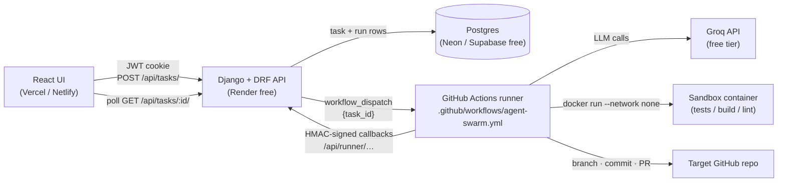

# Agent Swarm — Technical Guide

> The full reference: architecture, every setting, token setup, deployment, security and limitations. For a quick overview see the [README](../README.md).

Give Agent Swarm a **public GitHub repository** and an **improvement request**.
A pipeline of cooperating agents analyzes the repository, plans the change,
writes it, validates it in an isolated sandbox, reviews it, and opens a
**pull request** for a human to review — with every agent decision recorded
in an audit trace you can watch live.

```text
Repository:  https://github.com/example/project
Request:     Improve API performance and add appropriate caching.
                                   │
                                   ▼
   ✓ Repository analyzed   ✓ Plan created   ✓ Code modified
   ✓ Tests passed          ✓ Code reviewed  ✓ Pull Request created
                                   │
                          View Pull Request →
```

It never pushes to the default branch and never merges anything. Every change
lands on a new `agent-swarm/task-<id>-…` branch as a PR that a person has to
approve.

The whole system runs on free tiers: a Django API on a free web host,
Postgres on a free database host, the frontend on a free static host, LLM
calls on Groq's free tier, and the agents on **GitHub Actions**. Public
repositories get unlimited Actions minutes.

---

## Contents

- [Architecture](#architecture)
- [Agent workflow](#agent-workflow)
- [GitHub pull-request workflow](#github-pull-request-workflow)
- [Repository layout](#repository-layout)
- [Local development](#local-development)
- [Environment variables](#environment-variables)
- [Google and GitHub sign-in (OAuth)](#google-and-github-sign-in-oauth)
- [GitHub token setup](#github-token-setup)
- [GitHub Actions setup](#github-actions-setup)
- [Free deployment](#free-deployment)
- [Example end-to-end run](#example-end-to-end-run)
- [Example generated PR](#example-generated-pr)
- [Security considerations](#security-considerations)
- [Design notes](#design-notes)
- [Limitations and costs](#limitations-and-costs)

---

## Architecture



| Component | Role | Runs agents? |
|---|---|---|
| **Django API** (`backend/`) | Auth, task CRUD, dispatching runs, the signed runner API, persistence | **No.** It creates the task, fires the workflow, and returns. |
| **GitHub Actions** (`.github/workflows/agent-swarm.yml`) | Executes one task per workflow run: clone → agents → sandbox → PR | Yes |
| **Database** | Single source of truth for task state and the agent audit trail | — |
| **React UI** (`frontend/`) | Start runs, watch the pipeline, open the PR | — |

### How Celery and Redis were replaced

The old design ran the pipeline inside a Celery worker, used Redis as broker and
result backend, and wrote state with the Django ORM. That needed two long-running
processes plus a Redis server, which no free tier hosts reliably. The new design:

| Before | After |
|---|---|
| `run_pipeline.delay(task.id)` → Redis queue | `dispatch_task(task)` → GitHub `workflow_dispatch` with `{"task_id": "<id>"}` (`agents/pipeline/dispatch.py`) |
| Celery worker process | A GitHub-hosted runner running `python manage.py run_agent_task --task-id <id> --remote` |
| Worker writes to the DB via the ORM | The runner calls the **HMAC-signed runner API** (`agents/runner_api.py`), so it **never holds database credentials** |
| Celery result backend (Redis) | The `Task` row: status, current agent, plan, test results, review, branch, commit, PR URL, timestamps… |
| `celery -A orchestrator worker -P solo` for local dev | `PIPELINE_EXECUTOR=local`: Django spawns `run_agent_task` as a detached subprocess that writes through the ORM |

Both executors run the same orchestrator (`agents/pipeline/orchestrator.py`).
The only difference is the **reporter** that state goes through:

- `DbReporter` writes with the ORM (local executor).
- `HttpReporter` makes signed HTTP calls (GitHub Actions). It retries on 5xx and
  connection errors so a cold-starting free-tier API doesn't lose updates.

Both validate writes with the same `TaskStateSerializer` whitelist.

Removed outright: `orchestrator/celery.py`, `agents/tasks.py`, the
`celery`/`redis` dependencies, the `REDIS_URL`/`CELERY_*` settings, and the
Redis-only `docker-compose.yml`.

---

## Agent workflow

```text
Repository ─► Repository Analysis ─► Planner ─► Coder ─► Tester ─► Reviewer ─► Branch ─► Commit ─► Push ─► Pull Request
                                                  ▲         │          │
                                                  └─failure─┘          │
                                                  ▲                    │
                                                  └──── rejection ─────┘
```

| Stage | Module | LLM | What it does |
|---|---|---|---|
| **Repository analysis** | `services/analyzer.py` | none | Shallow-clones the repo and detects languages, frameworks, package manager, and the install/build/test/lint commands. It reads manifests only and never runs repo code. |
| **Planner** | `services/planner.py` | Groq (1 key) | Turns the request + file tree + stack summary into `{title, summary, steps}`. The title and summary become the PR title and the "Why" section. |
| **Coder** | `services/coder.py` | Groq (2 keys, LRU rotation) | Rewrites whole files. It sees the original request, the plan, and every file it touched in earlier attempts. Writes are path-checked: nothing outside the repo, nothing under `.git/` or `.github/workflows/`, no `.env` or key files. |
| **Tester** | `services/tester.py` | none | Installs dependencies, then runs every detected check **offline** in the Docker sandbox and decides pass/fail from the *required* checks. |
| **Reviewer** | `services/reviewer.py` | Groq (1 key) | Structured code review (see below). Deterministic safety checks can veto an LLM approval. |
| **GitHub** | `github/publisher.py` | none | Branch → commit → PR → labels → commit status. |

### Tester: stack detection

| Detected | Install (network on, no secrets) | Checks (network off) |
|---|---|---|
| **Python** (`requirements*.txt`, `pyproject.toml`, `setup.py`, `*.py`) | `pip install --target .agent_swarm/pydeps …` | `py_compile` on changed files · `pytest` (or `manage.py test` for Django) · `ruff`/`flake8` if configured *(advisory)* |
| **Node.js** (`package.json`) | `npm ci` / `npm install` · `corepack yarn` · `corepack pnpm` | `npm run build` if present · `npm test` (ignores the npm-init placeholder) · `npm run lint` *(advisory)* |
| **TypeScript** (`tsconfig.json` / `typescript` dep) | as Node | `npm run build`, or `tsc --noEmit` when there's no build script · `npm test` · lint *(advisory)* |
| Nothing recognised | — | none → tests reported as **SKIPPED** |

Required failures (install, build, tests) fail the attempt, and their logs go
back to the Coder. Lint failures are reported but never block the PR. Tests
show **PASS** only when a real test suite ran. A clean build with no suite is
**SKIPPED**, so the PR never claims tests passed when there were none. Pytest
exit code 5 ("no tests collected") also counts as skipped. Dependencies are
installed once and reinstalled only if the Coder edits a manifest.

### Reviewer: structured output

```json
{
  "approved": true,
  "summary": "Adds a TTL cache to GET /users with invalidation on writes; tests cover both paths.",
  "issues": [],
  "suggestions": ["Make the TTL configurable via settings"],
  "checks": {
    "implements_request": true, "follows_conventions": true, "tests_pass": true,
    "regression_risk": "low", "unnecessary_changes": false,
    "security_concerns": false, "ready_for_review": true
  }
}
```

The Reviewer checks that the request was actually implemented, that the code
follows repo conventions, that tests pass, how likely a regression is, whether
unrelated files changed, whether there are security problems, and whether the
change is ready for a human. On top of the model's verdict, **deterministic
checks force a rejection** when:

- secret patterns appear in the change (GitHub/Groq/OpenAI/Anthropic/AWS/Google/Slack tokens, private keys)
- a protected path was touched
- required validation is failing
- the change is empty

### Retries and self-correction (bounded)

```text
for review_cycle in range(MAX_REVIEW_RETRIES + 1):     # default 2 cycles
    for attempt in range(MAX_TEST_RETRIES):            # default 3 attempts
        Coder(feedback) → Tester → passed? break
        feedback = failing check logs
    else: fail ("validation still failing")
    Reviewer → approved? → publish PR
    feedback = reviewer issues
fail ("reviewer rejected")
```

Both loops are plain bounded `for` loops, so the pipeline cannot spin forever.
The worst case is `MAX_TEST_RETRIES × (MAX_REVIEW_RETRIES + 1)` Coder calls.
Nonsense values (0, negative) are clamped so every task gets at least one attempt.

### Retrying a failed task

A failed task shows a **Retry from \<stage\>** button (`POST /api/tasks/<id>/retry/`). There's no need to re-enter the repository or the request.

As each stage finishes, the run saves a **checkpoint** on the task: the base commit, the plan, the cumulative file contents, the last test result and the review. A retry restarts at the stage that failed and reuses everything before it:

| Failed at | Retry does |
|---|---|
| Planner | Re-runs the Planner. The repo analysis is recomputed silently. |
| Coder | Re-applies any saved code to the same base commit and continues the Coder with the last feedback. |
| Tester | Re-applies the saved code and runs the Tester first. If it still fails, the Coder gets the failure output and a fresh attempt budget. |
| Reviewer | Crash: re-runs only the Reviewer, using the saved passing test result. Rejection: Coder → Tester → Reviewer with the issues as feedback. |
| Pull Request | **Only the PR step.** No clone and no LLM calls; it publishes the approved checkpoint. |
| Clone, runner crash, timeout | Jumps to the furthest point the checkpoint supports. |

Rules:

- A stage is only skipped when its prerequisites are in the checkpoint. Otherwise the retry steps back, ending in a full run.
- The saved code is always re-applied to the **original base commit**, even if the default branch has moved since.
- **Restart from scratch** discards the checkpoint.
- Tasks created before checkpoints existed get one rebuilt from their recorded agent runs.
- The trace keeps every attempt's runs, and the PR's agent summary covers all of them.

---

## GitHub pull-request workflow

All GitHub logic lives in `backend/agents/github/`, separate from the agents:

| Module | Responsibility |
|---|---|
| `repo_url.py` | Strict `https://github.com/<owner>/<repo>` parsing (no credentials, extra segments, other hosts) |
| `validation.py` | Early checks at task creation: owner allow-list, repo exists, public, not archived |
| `client.py` | Minimal REST client: one session, token in the header only, typed errors |
| `publisher.py` | Repo validation, push-vs-fork decision, unique branch, commit, PR, labels, commit status |
| `pr_body.py` | PR title, Markdown body, commit message |

Publishing uses the **Git Data API**, so the token never touches a git remote URL
or `.git/config`:

The **GitHub agent** decides between two paths:

```text
Reviewer approved
      │
      ▼
GitHub agent: does the token have write access to the repo?
      │
 ┌────┴──────────────────────────┐
 YES                              NO
 │                                │
 ▼                                ▼
branch + commit on the repo    fork into the token's account
 │                              (or reuse the existing fork)
 │                                │
 │                              sync fork with upstream
 │                                │
 │                              branch + commit on the fork
 │                                │
 ▼                                ▼
PR  branch → main              PR  you:branch → upstream main
```

1. `GET /repos/{repo}` checks the repo exists and isn't archived. `GET /user` identifies the account the token acts as.
2. **Write access is decided in two steps.**
   - If the account has `push` permission, the agent tries the direct path.
   - That permission describes the *account*, not the token: a fine-grained token with read-only *Contents* still reports it. So the real answer is the first write. If it's refused (403), the agent falls back to the fork path. The refusal happens before any branch exists, so nothing is left behind.
   - If the repo belongs to the token's own account it can't be forked into that same account, so the error explains how to fix the token's permissions instead.
3. **Fork path** (`PR_ALLOW_FORKS`, on by default):
   - `POST /repos/{repo}/forks` creates the fork, or returns the existing one.
   - Wait for the fork to be ready, then `merge-upstream` so the base commit exists in it.
   - Commit and push the branch to the fork, then open the PR with `head=<you>:<branch>` against upstream.
4. Pick a unique branch: `agent-swarm/task-<id>-<slug>`, then `-2`, `-3`… if taken.
   Refuse outright if it would equal the default branch.
5. `POST git/trees` (changed files layered on the base commit's tree, preserving file modes) → `POST git/commits` (parent = the exact commit the agents cloned) → `POST git/refs` (**create** only; there is no code path that updates an existing ref).
6. `POST pulls` with the generated title/body (`maintainer_can_modify: true`, so maintainers can push fixes to a fork branch).
7. Direct path only: add labels (`agent-swarm`, `automated-pr`) and set an `agent-swarm/validation` commit status so the result shows in the PR's checks. On the fork path the token has no write access upstream, so these are skipped with a warning.
8. Store branch, commit SHA, PR URL and number on the task, plus the path taken and the access check (`final_result.pr_mode`, `head_repo`, `access`). The dashboard shows "opened directly" or "opened from fork …", and the agent trace has the full decision. The UI's **Refresh** button later re-reads the PR state (`open` / `merged` / `closed`).

Before committing, the publisher re-runs the secret/protected-path scan. This
is defense in depth, in case anything slipped past the Reviewer.

---

## Repository layout

```text
.github/workflows/agent-swarm.yml   GitHub Actions executor (one run per task)
render.yaml                         Render blueprint for the API (free plan)
backend/
├── orchestrator/                   Django project (settings, urls, wsgi)
├── accounts/                       Email/OAuth auth (dj-rest-auth + allauth, JWT cookies)
├── agents/
│   ├── models.py                   Task (persistent pipeline state) + AgentRun (audit trail)
│   ├── views.py                    /api/tasks/ (create → dispatch, refresh_pr, favorite, archive)
│   ├── runner_api.py               /api/runner/… HMAC-signed endpoints for the runner
│   ├── runner_auth.py              Request signing/verification shared by both sides
│   ├── pipeline/
│   │   ├── orchestrator.py         Stage sequencing + bounded retry loops + PR stage
│   │   ├── dispatch.py             Executors: github_actions | local
│   │   ├── reporting.py            DbReporter / HttpReporter
│   │   └── context.py              Per-run context handed to every agent
│   ├── services/                   The agents: analyzer, planner, coder, tester, reviewer
│   │   ├── key_pool.py             Coder key rotation (LRU + cooldown)
│   │   ├── safety.py               Secret patterns + protected paths
│   │   ├── repo.py                 Anonymous shallow clone + cleanup
│   │   └── common.py               track_run, strict-JSON salvage
│   ├── github/                     GitHub integration (see above)
│   ├── prompts/                    Versioned prompt templates
│   ├── sandbox.py                  Docker sandbox (no network, no host env, caps dropped)
│   ├── management/commands/
│   │   ├── run_agent_task.py       Runner entry point (both executors)
│   │   └── test_llm.py             Smoke-test the four Groq keys
│   └── tests/                      Backend test suite
└── docker/sandbox.Dockerfile       Python 3.11 + Node 20 + pytest/ruff/flake8
frontend/                           React 18 + Vite UI
(demo target)                       Toy Flask app used as an end-to-end target; its own repo at github.com/shob0902/demo_repo (not tracked here)
```

---

## Local development

**Prerequisites:** Python 3.11+, Node 18+, Git, and **Docker Desktop running**
(the Tester's sandbox). You also need four free Groq API keys from
[console.groq.com/keys](https://console.groq.com/keys); one account can issue
all four. To actually open PRs you need a GitHub token, covered below.

```bash
# 1. Sandbox image (once, and after editing the Dockerfile)
cd backend
docker build -t agent-swarm-sandbox:latest -f docker/sandbox.Dockerfile .

# 2. Backend
python -m venv venv
venv\Scripts\activate                 # source venv/bin/activate on macOS/Linux
pip install -r requirements.txt
copy .env.example .env                # cp on macOS/Linux; fill in GROQ_API_KEY_* and AGENT_GITHUB_TOKEN
python manage.py migrate
python manage.py test_llm             # optional: checks all four Groq keys
python manage.py runserver

# 3. Frontend (second terminal)
cd frontend
npm install
copy .env.example .env                # defaults point at localhost:8000
npm run dev
```

With the default `PIPELINE_EXECUTOR=local`, starting a task spawns
`python manage.py run_agent_task --task-id <id>` as a separate process. Its logs
appear in the `runserver` terminal. **No Redis, no worker process.** You can also
run a task by hand, which is useful for debugging:

```bash
python manage.py run_agent_task --task-id 12
```

Set `CREATE_PULL_REQUESTS=False` to stop after the Reviewer without touching GitHub.

**Tests:**

```bash
cd backend && python manage.py test agents accounts     # 118 tests, no network/Docker/LLM needed
cd frontend && npm run lint && npm run build
```

---

## Environment variables

Backend variables live in `backend/.env` locally and in the host's dashboard in
production. Runner variables live in **GitHub Actions secrets/variables**. Nothing
secret is ever exposed to the frontend.

| Variable | Where | Secret | Purpose |
|---|---|---|---|
| `DJANGO_SECRET_KEY` | API | ✅ | Django signing key |
| `DEBUG` | API | | `False` in production |
| `ALLOWED_HOSTS`, `CORS_ALLOWED_ORIGINS`, `CSRF_TRUSTED_ORIGINS`, `FRONTEND_BASE_URL` | API | | Hosting/CORS |
| `DATABASE_URL` | API | ✅ | Postgres URL; unset = SQLite |
| `PIPELINE_EXECUTOR` | API | | `local` (dev) or `github_actions` (prod) |
| `GITHUB_ACTIONS_REPO` | API | | `owner/Agent_Swarm`, the repo containing the workflow |
| `GITHUB_ACTIONS_WORKFLOW`, `GITHUB_ACTIONS_REF` | API | | Default `agent-swarm.yml`, `main` |
| `GITHUB_DISPATCH_TOKEN` | API | ✅ | Fires `workflow_dispatch`; also reads PR state for **Refresh** |
| `RUNNER_SHARED_SECRET` | API **and** Actions secret | ✅ | HMAC key for runner callbacks; must match on both sides |
| `ALLOWED_REPO_OWNERS` | API **and** Actions variable | | Optional owner allow-list |
| `GITHUB_VALIDATE_REPOS` | API | | Look the repo up at task creation (default `True`) |
| `AGENT_SWARM_API_URL` | Actions secret (or `.env` for local runs) | | Public API base, e.g. `https://agent-swarm-api.onrender.com/api` |
| `AGENT_GITHUB_TOKEN` | Actions secret (or `.env` with the local executor) | ✅ | Pushes the branch and opens the PR on target repos |
| `GROQ_API_KEY_PLANNER`, `GROQ_API_KEY_CODER_A`, `GROQ_API_KEY_CODER_B`, `GROQ_API_KEY_REVIEWER` | Actions secrets (or `.env`) | ✅ | One key per agent role |
| `GROQ_MODEL`, `GROQ_REASONING_EFFORT` | Actions variables | | Default `openai/gpt-oss-120b`, `low` |
| `MAX_TEST_RETRIES`, `MAX_REVIEW_RETRIES` | Actions variables | | Default `3`, `1` |
| `CREATE_PULL_REQUESTS` | runner | | Default `True` |
| `PR_ALLOW_FORKS`, `PR_LABELS`, `PR_BRANCH_PREFIX` | Actions variables | | Fork when the token can't write (default **on**), labels, branch prefix |
| `SANDBOX_*` | runner | | Image, timeouts, memory, dependency install toggle |

| `GOOGLE_CLIENT_ID`, `GOOGLE_CLIENT_SECRET` | API | ✅ (secret) | Google sign-in, see [Google and GitHub sign-in](#google-and-github-sign-in-oauth) |
| `GITHUB_CLIENT_ID`, `GITHUB_CLIENT_SECRET` | API | ✅ (secret) | GitHub sign-in (an OAuth App, separate from the PR tokens) |

Frontend (`frontend/.env`): only `VITE_API_BASE_URL`. The sign-in buttons get
their public client IDs from the backend at runtime.

> GitHub forbids secret/variable names starting with `GITHUB_` in Actions,
> which is why the runner-side PR settings use the `PR_` prefix.

---

## Google and GitHub sign-in (OAuth)

Users can sign in with **Google**, **GitHub**, or email and password. All three
end in the same session: HttpOnly JWT cookies set by the API.

```text
Login page ──GET /api/auth/providers/──► API   (public client IDs, enabled flags)
   │ click "Continue with GitHub"
   ▼  state = 256-bit random, kept in sessionStorage
GitHub consent screen ──redirect──► /auth/callback/github?code=…&state=…
   │ state checked (same tab, same provider, < 10 min, single use)
   ▼
POST /api/auth/github/ {code, redirect_uri} ──► API exchanges the code with GitHub (server-side, with the secret)
   ▼
JWT cookies set ──► back to the page the user started from
```

**1. Create the OAuth clients.** Register one callback URL per frontend origin:
`<frontend-origin>/auth/callback/google` and `<frontend-origin>/auth/callback/github`.

- **Google:** [console.cloud.google.com/apis/credentials](https://console.cloud.google.com/apis/credentials) → *Create credentials → OAuth client ID → Web application*.
  - Add each origin (e.g. `http://localhost:5173`, `https://your-app.vercel.app`) under *Authorized JavaScript origins*.
  - Add each callback URL (e.g. `http://localhost:5173/auth/callback/google`) under *Authorized redirect URIs*.
  - Configure the consent screen with the scopes `openid`, `email`, `profile`.
- **GitHub:** [github.com/settings/developers](https://github.com/settings/developers) → *New OAuth App*.
  - *Homepage URL* = the frontend origin. *Authorization callback URL* = `<origin>/auth/callback/github`.
  - Add one redirect URI per frontend origin. A single app can hold up to 10, e.g. `https://agswarm.netlify.app/auth/callback/github` and `http://localhost:5173/auth/callback/github`. Leave wildcard matching and Device Flow off.
  - This is **not** the token that opens PRs. It only asks for `read:user user:email`.

**2. Configure the backend** (`backend/.env` locally, the host dashboard in production):

```env
GOOGLE_CLIENT_ID=…apps.googleusercontent.com
GOOGLE_CLIENT_SECRET=…
GITHUB_CLIENT_ID=…
GITHUB_CLIENT_SECRET=…
FRONTEND_BASE_URL=https://your-app.vercel.app        # default callback origin
CORS_ALLOWED_ORIGINS=https://your-app.vercel.app      # other accepted callback origins
```

Nothing goes in the frontend. A button stays disabled until the backend has *both*
the ID and the secret for that provider.

**Security properties:**

- **CSRF protection:** a random `state` is sent to the provider and must come back unchanged to the same tab within 10 minutes. It is single-use.
- **Code exchange only.** The API rejects raw `access_token`/`id_token` logins (dj-rest-auth allows them by default), so a token issued to another app can't be replayed here. The secret never leaves the server, and provider tokens aren't stored (`SOCIALACCOUNT_STORE_TOKENS=False`).
- **Redirect URIs** must be `<origin>/auth/callback/<provider>` for `FRONTEND_BASE_URL` or a `CORS_ALLOWED_ORIGINS` origin. Anything else is rejected before the provider is contacted.
- **Verified emails only:**
  - OAuth sign-up requires an email the provider marks as verified (Google `email_verified`, GitHub `/user/emails` `verified`).
  - An existing account is linked **only** through such an email. When that happens and the account's password was set by an unverified email sign-up, the password is retired. This stops someone pre-registering your address and keeping access.
  - Accounts with no verified email get a clear error instead of an account.
- The authorization code is removed from the address bar before it's used.

---

## GitHub token setup

Use **fine-grained personal access tokens**
(GitHub → Settings → Developer settings → Fine-grained tokens). Use two tokens,
each with the smallest scope that works:

**1. `GITHUB_DISPATCH_TOKEN`: lets the API start runs (lives on the web host)**
- Repository access: **only** your `Agent_Swarm` repository
- Permissions: **Actions: Read and write** (Metadata: read is automatic)

**2. `AGENT_GITHUB_TOKEN`: lets the runner open PRs (lives in Actions secrets)**

The forks and PRs are created as the account that owns this token. What it needs
depends on which repositories you'll point the swarm at:

| Target repositories | Recommended token |
|---|---|
| Only your own repos | **Fine-grained**, access to those repos: **Contents** + **Pull requests** *Read and write* (optionally **Commit statuses** and **Issues** for the check and labels) |
| Anyone's public repos (fork path) | **Classic** token with the **`public_repo`** scope. It can fork, push to the fork, and open PRs on upstream repositories you're not a member of. |

A fine-grained token can be made to work for forks too:
- Set *Repository access* to **All repositories**, because the fork is a new repository, and give it **Administration**, **Contents** and **Pull requests** *Read and write*.
- GitHub may still refuse to let it open PRs on repositories outside its owner. If that happens the agent reports it and gives you a ready-made compare link to open the PR by hand.

Every failure in this stage, whether no write access, a refused fork, a refused
write to the fork, or a refused upstream PR, gives a message that names the
permission or scope to fix. It never fakes a PR.

---

## GitHub Actions setup

1. Push this project to GitHub. Keep the repo **public** if you want unlimited free minutes.
2. In that repo go to **Settings → Secrets and variables → Actions**.
   - **Secrets:** `AGENT_SWARM_API_URL`, `RUNNER_SHARED_SECRET`, `AGENT_GITHUB_TOKEN`,
     `GROQ_API_KEY_PLANNER`, `GROQ_API_KEY_CODER_A`, `GROQ_API_KEY_CODER_B`, `GROQ_API_KEY_REVIEWER`
   - **Variables (optional):** `GROQ_MODEL`, `MAX_TEST_RETRIES`, `MAX_REVIEW_RETRIES`,
     `PR_ALLOW_FORKS`, `ALLOWED_REPO_OWNERS`, `PR_LABELS`
3. On the API host, set `PIPELINE_EXECUTOR=github_actions`, `GITHUB_ACTIONS_REPO=<you>/Agent_Swarm`,
   `GITHUB_DISPATCH_TOKEN`, and the same `RUNNER_SHARED_SECRET`.

What `.github/workflows/agent-swarm.yml` does:

- **Trigger:** `workflow_dispatch` only. Its single input is the numeric `task_id`, which is validated with a regex and passed via `env` to avoid script injection. Only users with write access to the repo (or the dispatch token) can trigger it.
- **Permissions:** `contents: read` for the workflow's own `GITHUB_TOKEN`. All writes to the target repo go through `AGENT_GITHUB_TOKEN`.
- **Steps:** checkout (`persist-credentials: false`) → Python 3.11 with pip cache → `pip install` → build the sandbox image → `manage.py run_agent_task --task-id $TASK_ID --remote`.
- **Secrets scoping:** LLM keys and the PR token are only exported to the step that runs the pipeline. The sandbox containers never receive host environment variables.
- **Crash handling:** a final `if: failure() || cancelled()` step marks the task failed (unless it already has an outcome), so the UI never shows a dead run as "running".
- **Limits:** `timeout-minutes: 45`, `concurrency` keyed on the task id so a duplicate dispatch can't run the same task twice in parallel. The runner also refuses to re-run a finished task.

You can also trigger a run by hand from the **Actions** tab ("Run workflow", enter a task id).

---

## Free deployment

| Piece | Free option | Notes |
|---|---|---|
| Agent execution | **GitHub Actions** | Unlimited minutes for public repos; 2,000 min/month for private ones |
| API | **Render** free web service (`render.yaml`) · or Koyeb free | Free instances sleep after ~15 min idle; the runner's callback client retries through the cold start |
| Database | **Neon** or **Supabase** free Postgres | Set `DATABASE_URL` (`?sslmode=require`). Avoid Render's free Postgres, which expires after 30 days |
| Frontend | **Vercel**, **Netlify** or **Cloudflare Pages** | Build `npm run build`, output `dist/`, env `VITE_API_BASE_URL=https://<api>/api` |
| LLM | **Groq** free tier | Four keys, one per role |

Steps:

1. **Database:** create a Neon project and copy its connection string.
2. **API:** on Render, use *New → Blueprint* and pick this repo (it reads `render.yaml`). Then fill in the `sync: false` variables: `DATABASE_URL`, `ALLOWED_HOSTS=<app>.onrender.com`, `CORS_ALLOWED_ORIGINS`/`CSRF_TRUSTED_ORIGINS`/`FRONTEND_BASE_URL` = your frontend URL, `GITHUB_ACTIONS_REPO`, `GITHUB_DISPATCH_TOKEN`, `RUNNER_SHARED_SECRET`, and the `GOOGLE_*`/`GITHUB_CLIENT_*` OAuth pairs. Migrations run on start.
3. **Frontend:** import `frontend/` into Vercel with `VITE_API_BASE_URL=https://<app>.onrender.com/api`. Add a SPA rewrite to `index.html` if your host needs one.
4. **Actions:** add the secrets from [GitHub Actions setup](#github-actions-setup), with `AGENT_SWARM_API_URL=https://<app>.onrender.com/api`.
5. Optional: create an admin with `python manage.py createsuperuser` from the Render shell. `/admin/` shows every Task and AgentRun.

Cross-site cookies: the frontend and API are on different domains, so with
`DEBUG=False` the auth cookies are sent as `SameSite=None; Secure` (already
configured).

---

## Example end-to-end run

1. Sign in and open the dashboard.
2. **Repository:** `https://github.com/<you>/demo_repo`. **Request:** *"Add input validation for the username field on POST /signup and cover it with tests."*
3. Click **Start Agent**. The API validates the URL and confirms the repo is public, stores the task as `queued`, fires `workflow_dispatch`, and returns the task id. The URL becomes `/dashboard?task=<id>`, so a refresh keeps your place.
4. About 30–60 s later the runner reports in, and the pipeline panel advances:
   `Repository analyzed → Plan created → Code modified → Tests passed → Code reviewed → Pull Request created`.
   The **Agent Execution Log** shows each run: Analyzer (stack `Python · Flask`, checks `compile, pytest`), Planner (title + steps), Coder (files changed, which Groq key served it), Tester (`pytest: 5 passed`), Reviewer (verdict + suggestions), GitHub (PR URL).
   If the first attempt fails `pytest`, you'll see *Coder attempt 2* with the failure output as its feedback.
5. The panel shows the branch `agent-swarm/task-<id>-add-username-validation`, the commit SHA, the Actions run link, and **View Pull Request #N →**.
6. Review and merge, or close, the PR on GitHub. **Refresh** updates the PR state in the dashboard.

---

## Example generated PR

```markdown
## 🤖 Agent Swarm Generated PR

> This pull request was generated autonomously and **must be reviewed by a human before merging**.

### Objective

> Improve API performance and add appropriate caching.

### Why this change

GET /users rebuilt the full user list on every request. This adds an in-process TTL cache and invalidates it whenever a user is created.

### Planner summary

1. Add a small TTL cache helper in app/cache.py
2. Wrap the GET /users handler in app.py with the cache
3. Invalidate the cache in POST /signup after a successful insert
4. Add tests for cache hits and invalidation in test_app.py

### Files changed

- `app/cache.py` (added)
- `app.py` (modified)
- `test_app.py` (modified)

### Validation

- **Tests:** PASS
- **Reviewer:** APPROVED
- **Retries:** 1 Coder retry, 0 review cycle(s)

| Check | Command | Result |
|---|---|---|
| pip install | `python -m pip install … -r requirements.txt` | ✅ passed |
| compile | `python -m py_compile app.py app/cache.py test_app.py` | ✅ passed |
| pytest | `python -m pytest -q --no-header -p no:cacheprovider` | ✅ passed — 6 passed |

### Reviewer decision

Implements a bounded TTL cache with invalidation on writes; follows the existing module style.

**Suggestions:**

- Make the TTL configurable

### Agent pipeline

Repository Analysis → Planner → Coder → Tester → Reviewer → Pull Request

<details><summary>Agent execution summary</summary> … per-run table … </details>

---
Agent Swarm task #42 · [execution log](https://github.com/<you>/Agent_Swarm/actions/runs/…)
```

The PR also gets the `agent-swarm` and `automated-pr` labels and an
`agent-swarm/validation` commit status (direct mode).

---

## Security considerations

- **No secrets in the browser.** The frontend only knows the API URL and the public OAuth client IDs it fetches from the API. Tokens and LLM keys live in host env vars and Actions secrets, and no serializer returns them.
- **Least privilege by placement.** The web host holds only the dispatch token, which can start workflows in one repo. The runner holds the LLM keys and PR token but **no database credentials**: it can only write whitelisted state fields through the HMAC-signed runner API.
- **Runner API hardening.** Signatures cover method, path, timestamp and body hash. Requests older than 5 minutes are rejected, comparison is constant-time, and with no secret configured the API rejects everything. Finished tasks and finished runs are immutable (409), which stops replays from rewriting history. Users can't write state fields, and the request/repo are fixed after creation.
- **Untrusted code stays in the sandbox.** Every install, build, test and lint command runs in a Docker container that has no host environment (only fixed, harmless variables), `cap_drop=ALL`, `no-new-privileges`, a PID and memory limit, a timeout, and the host UID on Linux. Tests, builds and lint run with **network disabled**. Only dependency installation gets network, and that step has no secrets to leak.
- **Input validation.** Repo URLs must match `https://github.com/<owner>/<repo>` exactly, with no credentials, extra segments or other hosts. Clones are anonymous (`GIT_TERMINAL_PROMPT=0`). The workflow's `task_id` input is regex-checked and never interpolated into shell. An optional `ALLOWED_REPO_OWNERS` allow-list applies.
- **Write guards.** The Coder can't write outside the repo, into `.git/`, `.github/workflows/`, `.env*` or key files. Secret patterns block both the Reviewer approval and the commit itself.
- **Never on main, never merged.** Branches are created, never updated. A branch name equal to the default branch is refused. There is no merge call anywhere in the code.
- **Public Actions logs.** On a public repo, workflow logs are public. The runner logs stage progress and errors, which can include short excerpts of model output or test logs, but not prompts. GitHub masks secret values. Don't submit requests containing anything private. If that matters, make the repo private (2,000 free min/month).
- **Abuse.** The fork path is **on by default**, so any signed-in user of a public deployment could have the bot fork and open PRs on any public repository, as the token's account. For a public deployment, set `ALLOWED_REPO_OWNERS`, or `PR_ALLOW_FORKS=false` to allow only repositories the token can write to.

---

## Design notes

These are kept from the original implementation; they still apply.

- **One provider (Groq), four keys.** Each role has its own key, so one role exhausting its quota can't starve the others. Gemini was dropped because its free tier is capped per Google Cloud *project* (20 requests/day, shared by every key in the project), which a single multi-retry run exhausts.
- **Coder key rotation** (`services/key_pool.py`). The least-recently-used key goes first, so in steady state the keys alternate. A 429 benches that key with a doubling cooldown (60 s → 480 s cap). Other failures get a 15 s bench. On any failure the Coder fails over to the sibling key, and cooling keys are still tried as a last resort. Pool state lives in process memory, so each Actions run starts fresh. `AgentRun.output.key_slot` / `keys_tried` record which key served each call.
- **Model and token budget.** The default model is `openai/gpt-oss-120b`, because Groq retired `llama-3.1-8b-instant`. Its free tier allows 8,000 tokens per minute per key, counting prompt and completion together. gpt-oss reasons before it answers, and those reasoning tokens count against `max_tokens`, so the pipeline sends `reasoning_effort=low` (`GROQ_REASONING_EFFORT`). Measured on a Planner-style prompt, that costs roughly 40–130 tokens of reasoning. The Coder reserves 3,000 output tokens, the Planner 1,500 and the Reviewer 1,024, and prompts are trimmed to at most 20 kB of file context and 6 kB of diff. `finish_reason=length` is raised as an explicit truncation error. `reasoning_effort` is sent only to `openai/gpt-oss*` models, so pointing `GROQ_MODEL` at a non-reasoning model still works.
- **Whole-file rewrites, real diffs.** The Coder returns `{"files": [{path, content}]}` rather than LLM-written unified diffs, which are fragile. The real `git diff` is computed afterwards, cumulatively against the original commit across every attempt, for the Reviewer, the UI and the PR.
- **Surviving malformed model output.** `parse_strict_json` tolerates prose, code fences and trailing text, and uses `raw_decode` for the first JSON value. The Coder re-asks up to twice on unusable output, with a short corrective note rather than echoing the broken output back.
- **Every `AgentRun` is created before its call** and updated afterwards, even on exceptions, so a crashed agent is always visible in the trace.

---

## Limitations and costs

- **Public repositories first.** Cloning is anonymous, so private repos are rejected at creation.
- **Monorepos:** stack detection looks at the repository root, so a `frontend/package.json` in a subfolder isn't detected as a Node project. Validation then covers only what's detected at the root.
- **Model capability:** `gpt-oss-120b` on Groq's free tier handles focused, small changes well, within Groq's free-tier per-minute and per-day limits for each key (see console.groq.com/settings/limits). Large refactors or multi-file features often exhaust retries. The Coder sees about 20 kB of context and rewrites whole files, so very large files are a poor fit. `GROQ_MODEL` can point at any other chat model your Groq key lists.
- **Dependency installs** need a lockfile or requirements file that resolves on Linux/Python 3.11/Node 20. Services such as databases or Redis aren't available inside the sandbox, so suites that need them will fail.
- **Latency:** an Actions run takes about 30–60 s to start, plus building the sandbox image (about 1 min uncached). Expect 2–6 minutes per task. A free API instance may also add a cold start of up to about 1 min.
- **No live log streaming:** the UI shows per-agent records as each one finishes. Raw console output is in the linked Actions run.
- **Costs:** $0 on the stack above for portfolio-level use. Limits to watch: Groq free-tier rate limits, 2,000 Actions minutes/month if the repo is private, Neon's free storage and compute hours, and Render's sleep-after-idle.
- The PDF in `docs/` documents the earlier Celery/Redis design and has not been regenerated.
